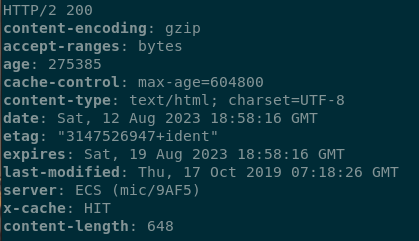

<h1 align="center"> Práctica 2 Capa de Aplicación - HTTP</h1>

- [2. ¿Cuál es la función de la capa de aplicación?]()
- [3. Si dos procesos deben comunicarse]()
- [4. Explique brevemente cómo es el modelo Cliente/Servidor.]()
- [5. Describa la funcionalidad de la entidad genérica “Agente de usuario” o “User agent”.]()
- [6. ¿Qué son y en qué se diferencian HTML y HTTP?]()
- [7. Utilizando la VM, abra una terminal. Investigue sobre el comando curl]()
- [8. Ejecute el comando curl sin ningún parámetro adicional y acceda a www.redes.unlp.edu.ar.]()
- [9. Ejecute a continuación los siguientes comandos]()
- [10. Ejecute una vez más el comando curl www.redes.unlp.edu.ar ]()
- [11. Utilizando la VM, realice las siguientes pruebas]()
- [12. En base a lo obtenido en el ejercicio anterior, responda]()
- [13. La página www.redes.unlp.edu.ar/http/idioma.php tiene soporte para visualizarse en inglés y en español.]()
- [14. En el siguiente ejercicio veremos la diferencia entre los métodos POST y GET.]()
- 

### Introducción

#### 2. ¿Cuál es la función de la capa de aplicación?

Se encarga de proporcionar servicios y funciones específicas para las aplicaciones y usuarios finales. Es la capa más visible y familiar para los usuarios, ya que es donde ocurre la interacción directa con la red y donde se realizan muchas de las actividades cotidianas en línea, como navegación web, correo electrónico y transferencia de archivos.

#### 3. Si dos procesos deben comunicarse: 
Si dos procesos deben comunicarse, las formas en que lo hacen difieren según si están en diferentes máquinas o en la misma máquina:

***a. ¿Cómo podrían hacerlo si están en diferentes máquinas?***

- **1)** **Sockets:** Los sockets son una forma común de comunicación entre procesos en diferentes máquinas a través de redes. Se establece una conexión entre los sockets en las máquinas remotas, permitiendo el intercambio de datos.
- **2)** **Protocolos de Internet:** Se pueden utilizar protocolos como HTTP, FTP, MQTT, entre otros, para comunicar procesos en diferentes máquinas a través de la red.
- **3)** **Web Services:** Utilizar tecnologías como servicios web (SOAP, REST) para permitir que los procesos se comuniquen a través de la web.
- **4)** **Colas de Mensajes:** Utilizar sistemas de colas de mensajes (como RabbitMQ o Apache Kafka) para enviar y recibir mensajes entre procesos distribuidos.

***b. Y si están en la misma máquina, ¿qué alternativas existen?***

- **1)** **Pipes (Tubos):** Los pipes son una forma de comunicación entre procesos dentro de la misma máquina. Hay pipes anónimos y con nombre, y se utilizan para transmitir datos de un proceso a otro.
- **2)** **Comunicación a Través de Memoria Compartida:** Los procesos pueden compartir una región de memoria en la que almacenan y leen datos.
- **3)** **Sockets Locales:** Los sockets también se pueden usar para comunicación entre procesos en la misma máquina, a menudo conocidos como sockets locales o Unix sockets.
- **4)** **RPC (Remote Procedure Call):** Aunque es más común para la comunicación remota, también puede utilizarse para comunicación entre procesos en la misma máquina.

> Cada enfoque tiene sus ventajas y desventajas según los requisitos específicos del sistema y el entorno. La elección depende de factores como la complejidad, la seguridad, la velocidad y la escalabilidad requerida.

#### 4. Explique brevemente cómo es el modelo Cliente/Servidor.

El modelo Cliente/Servidor es un paradigma en el diseño de sistemas de software y arquitecturas de red. En este modelo, los roles de los participantes se dividen en dos categorías principales: el cliente y el servidor. Aquí está una breve explicación de cómo funciona:

<table><tr><td>Cliente</td><td>Servidor</td></tr>

<tr><td>

El cliente es un dispositivo, aplicación o proceso que solicita y consume los servicios proporcionados por el servidor.
El cliente inicia la comunicación enviando una solicitud al servidor y espera una respuesta.
Puede haber varios clientes conectados al mismo servidor al mismo tiempo.
</td><td>

El servidor es un dispositivo, aplicación o proceso que proporciona servicios, recursos o datos a los clientes.
Escucha y espera solicitudes de los clientes.
Procesa las solicitudes, realiza las operaciones requeridas y envía las respuestas de vuelta al cliente.
</td></tr>
</table>

***De un ejemplo de un sistema Cliente/Servidor en la “vida cotidiana”***

Los servidores de correo (servidores) proporcionan los servicios de almacenamiento y entrega de mensajes, mientras que las aplicaciones de correo (clientes) permiten a los usuarios acceder y gestionar sus correos electrónicos

***y un ejemplo de un sistema informático que siga el modelo Cliente/Servidor.***

Un ejemplo de sistema informático que sigue el modelo Cliente/Servidor es una aplicación de banca en línea:

- **Cliente** Aplicación o sitio web de banca en línea utilizada por los usuarios para acceder a sus cuentas y realizar transacciones.
- **Servidor** Los servidores de la institución bancaria almacenan y gestionan los datos financieros de los usuarios y manejan las solicitudes de servicios.
- **Funcionamiento** Los usuarios interactúan con la aplicación cliente, que envía solicitudes a los servidores bancarios a través de Internet. Los servidores procesan las solicitudes y devuelven información sobre cuentas y transacciones.
- **Interacción** Cliente y servidor se comunican constantemente para permitir a los usuarios acceder, gestionar y realizar transacciones financieras en línea.

***¿Conoce algún otro modelo de comunicación?***

Existen varios modelos de comunicación además del Cliente/Servidor y el modelo OSI:

- **1)** **P2P (Peer-to-Peer):** Dispositivos se conectan directamente sin servidor central.
- **2)** **Cliente-Servidor Distribuido:** Múltiples servidores en diferentes ubicaciones.
- **3)** **Arquitectura SOA (Orientada a Servicios):** Servicios reutilizables a través de interfaces estándar.
- **4)** **Publicación/Suscripción:** Usuarios se suscriben a eventos, notificaciones automáticas.
- **5)** **Mensajería Instantánea:** Comunicación en tiempo real a través de mensajes cortos.
- **6)** **Intercambio de Datos en Lotes:** Procesamiento de datos en lotes en momentos específicos.

Cada modelo tiene su propósito y es utilizado según la aplicación y las necesidades tecnológicas actuales.

#### 5. Describa la funcionalidad de la entidad genérica “Agente de usuario” o “User agent”.

Un agente de usuario es un software o dispositivo que actúa en nombre de un usuario para interactuar con sistemas y servicios en línea. Representa al usuario, adapta la información según preferencias y capacidades, intercambia datos con servidores, y puede realizar tareas automatizadas y gestionar aspectos de autenticación y seguridad. Su función clave es facilitar la interacción efectiva entre el usuario y la tecnología.

### HTTP

#### **6)** ¿Qué son y en qué se diferencian HTML y HTTP?

HTML es el lenguaje que define la estructura y el contenido visual de una página web, mientras que HTTP es el protocolo que permite que los navegadores y los servidores se comuniquen y transfieran esos contenidos a través de la web. Ambos son esenciales para la creación y visualización de sitios web en línea.

#### **7)** Utilizando la VM, abra una terminal. Investigue sobre el comando curl y analice para qué sirven los siguientes parámetros (-I, -H, -X, -s).

El comando **curl** es una herramienta de línea de comandos utilizada para transferir datos con URL. Se utiliza principalmente para realizar solicitudes a servidores web y obtener respuestas. Aquí están los parámetros que mencionaste:

- **-I**: Este parámetro solicita solamente la información de encabezado de la respuesta del servidor. Es útil para obtener detalles como la fecha, la longitud del contenido, los tipos MIME y más, sin descargar todo el contenido.
- **-H**: Se utiliza para agregar encabezados personalizados a la solicitud HTTP. Puedes especificar encabezados adicionales junto con sus valores para personalizar la solicitud.
- **-X**: Cambia el método de solicitud HTTP utilizado. Por defecto, **curl** realiza solicitudes GET, pero con este parámetro, puedes usar otros métodos como POST, PUT, DELETE, etc.
- **-s**: Este parámetro hace que **curl** funcione en modo silencioso. Evita que se muestren mensajes de progreso y solo muestra la respuesta o el error. Es útil cuando se utiliza **curl** en secuencias de comandos o para obtener solo los datos de la respuesta.

Por ejemplo, puedes usar 
- **curl -I https://www.example.com** para obtener los encabezados de respuesta del sitio web "example.com".

- **curl -X POST -H "Content-Type: application/json" -d '{"key": "value"}' https://api.example.com** para realizar una solicitud POST con datos JSON a una API en "api.example.com".

#### **8)** Ejecute el comando curl sin ningún parámetro adicional y acceda a www.redes.unlp.edu.ar. Luego res- ponda:

**a)** ¿Cuántos requerimientos realizó y qué recibió? Pruebe redirigiendo la salida(>)del comando curl a un archivo con extensión html y abrirlo con un navegador.

**b)** ¿Cómo funcionan los atributos href de los tags link e img en html?

**c)** Para visualizar la página completa con imágenes como en un navegador, 
- ¿alcanza con realizar un único requerimiento? 
- ¿Cuántos requerimientos serían necesarios para obtener una página que tiene dos CSS, dos Javascript y tres imágenes? 
- Diferencie como funcionaría un navegador respecto al comando curl ejecutado previamente.

#### 9. Ejecute a continuación los siguientes comandos:
- curl -v -s www.redes.unlp.edu.ar > /dev/null
- curl -I -v -s www.redes.unlp.edu.ar
- ¿Qué diferencias nota entre cada uno?
- ¿Qué ocurre si en el primer comando quita la redirección a /dev/null? ¿Por qué no es necesaria en el segundo comando?
- ¿Cuántas cabeceras viajaron en el requerimiento? ¿Y en la respuesta?

#### 10. Ejecute una vez más el comando curl www.redes.unlp.edu.ar pero sólo muestre los encabezados y luego responda:
***a. ¿Es posible determinar qué servidor web se utiliza para servir la página?***

***b. ¿Cuál es el código de respuesta que devolvió el servidor? ¿Qué otros códigos existen y qué significan? Investigue genéricamente los tipos de error 2XX, 3XX, 4XX y 5XX.***

***c. ¿Cuándo fue la última vez que se modificó la página?***

d. Solicite la página nuevamente con curl usando GET, pero esta vez indique que quiere obtenerla sólo si la misma fue modificada en una fecha posterior a la que efectivamente fue modificada. 
- ¿Cómo lo hace? 
- ¿Qué resultado obtuvo? 
- ¿Puede explicar por qué y para qué sirve?

***e. ¿Qué significa el encabezado ETag?***

f. Investigue el encabezado If-Modified-Since. 
- ¿Para qué cree que pueden servir los tres encabezados anteriores?